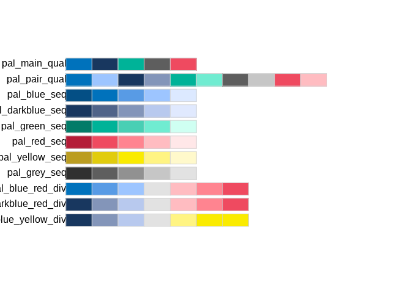
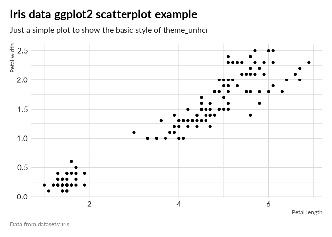
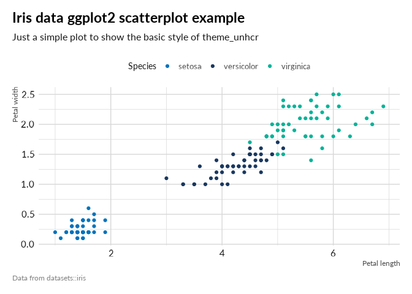

<!-- README.md is generated from README.Rmd. Please edit that file -->

# unhcrthemes

<!-- badges: start -->

[](https://github.com/vidonne/unhcrthemes/actions)
<!-- badges: end -->

The `unhcrthemes` package provide a set of `rmarkdown` templates, color
palettes and themes for plots based on UNHCR brand book. The goal of
this package is to ease and speed up the creation of reproducible
reports and charts, while promoting the UNHCR visual identity.

## Installation

This package is not on yet on CRAN and to install it, you will need the
`remotes` package.

``` r
# install.packages("remotes")
remotes::install_github("vidonne/unhcrthemes")
```

## Content

A package with all necessary elements to quickly implement UNHCR Brand
style in your statistical products and data stories:

1.  Adjusted `ggplot2` theme
2.  A series of color palette for:
    -   **WIP** Discrete palette with either fixed or dynamically
        extended number of shades
    -   **WIP** Continuous diverging color palette
    -   **WIP** Continuous color palette

## Usage

First make sure to have all your fonts - and specifically **Lato** -
registered with R

``` r
library(unhcrthemes)
library(ggplot2)

# install.packages('showtext', dependencies = TRUE)
library(showtext)

# Check the current search path for fonts
allfontpath <- font_paths()

# syntax: font_add(family = "<family_name>", regular = "/path/to/font/file")
font_add("Lato", regular = "Lato-Regular.ttf",  bold = "Lato-Bold.ttf", italic = "Lato-Italic.ttf")

# automatically use showtexts for new devices
showtext::showtext_auto()
```

### UNHCR color palette

``` r
display_unhcr_all()
```

<!-- -->

### Base ggplot2 theme

``` r
library(ggplot2)
ggplot(datasets::iris, aes(x = Petal.Length, y = Petal.Width)) +
  geom_point() +
  labs(x = "Petal length", y="Petal width",
      title = "Iris data ggplot2 scatterplot example",
      subtitle = "Just a simple plot to show the basic style of theme_unhcr",
      caption = "Data from datasets::iris") +
  theme_unhcr()
```

<!-- -->

### Base ggplot2 theme + color scale

``` r
ggplot(datasets::iris, aes(x = Petal.Length, y = Petal.Width)) +
  geom_point(aes(color = Species)) +
  scale_color_unhcr_d(palette = "pal_main_qual") +
  labs(x = "Petal length", y="Petal width",
      title = "Iris data ggplot2 scatterplot example",
      subtitle = "Just a simple plot to show the basic style of theme_unhcr",
      caption = "Data from datasets::iris") +
  theme_unhcr()
```

<!-- -->

### unhcrverse

This package is part of `unhcrverse`, a set of packages to ease the
production of statistical evidence and data stories. You can install
them all with the following:

``` r
## Use UNHCR Open data  - https://unhcr.github.io/unhcrdatapackage/docs/
remotes::install_github('unhcr/unhcrdatapackage')

## API to connect to internal data source - https://unhcr-web.github.io/hcrdata/docs/
remotes::install_github('unhcr-web/hcrdata')

## Perform High Frequency Check https://unhcr.github.io/HighFrequencyChecks/docs/
remotes::install_github('unhcr/HighFrequencyChecks')

## Process data crunching for survey dataset - https://unhcr.github.io/koboloadeR/docs/
remotes::install_github('unhcr/koboloadeR')

## Use UNHCR graphical template- https://unhcr-web.github.io/unhcRstyle/docs/
remotes::install_github('unhcr-web/unhcRstyle')
```
